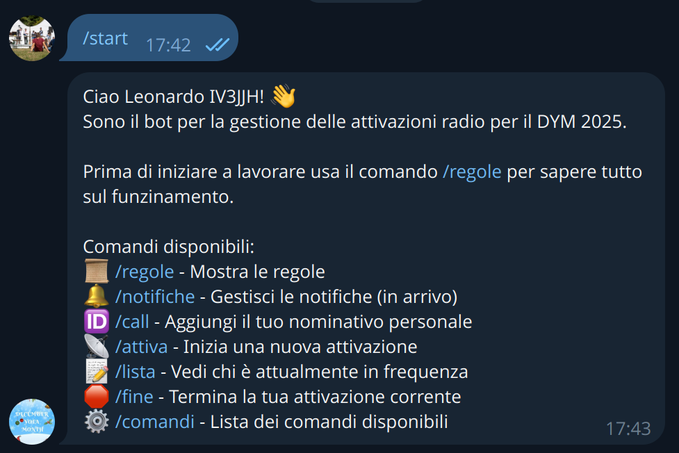
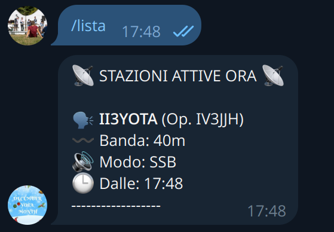

Nel 2025 mi sono cimentato nella programmazione di un bot telegram per la gestione dei nominativi speciali usati dal gruppo **YOTA ITALIA** durante il December Yota Month.  

L'idea alla base di questo sistema era quella di permettere ai ragazzi del gruppo di operare in maniera ordinata, senza avere conflitti con i nominativi, rispettando le regole dell'attività e poter caricare in maniera automatica i log sul sito apposito.  

Il bot inzialmente è stato programmato interamente da me, in seguito grazie al prezioso aiuto di Marco, IU7UGJ, abbiamo apportato molti miglioramenti e altri verranno ancora fatti in futuro.

Il cuore del progetto è un programma python che viene eseguito su un server, che si occupa di tutte le richieste di attivazione e gestisce i nominativi secondo le regole che sono state impostate. Per la parte di invio dei log sul sito del DYM (December Yota Month) abbiamo sfruttato la API messe a disposizione integrandole nel codice in modo che l'operatore a fine attività semplicemente mandando il file .adif in chat al bot lo vedeva caricato sul sito.  

Oltre a gestire la propria attività dal bot era possibile anche informarsi su quali nominativi erano in uso, su che bande, in che modo, ecc. Parlando con i ragazzi del gruppo abbiamo deciso anche di implementare una funzione che permettesse qualora attivata di sapere quando qualcuno iniziava una attività tramite un messaggio.  

Il progetto è stato sviluppato con l'idea di avere un ambiente facile da usare per chi opera ma anche per chi lo matiene attivo, infatti almeno inizialmente non sono stati inseriti database o tante funzionalità ma ci siamo concentrati sulle funzioni di base in maniera da renderle il più facili da usare possibili. In una seconda fase, grazie al già citato Marco abbiamo implementato un database per gestire meglio tutta la parte di utenti e nominativi, e alcune funzioni aggiuntive. 

Il codice è disponibile sul mio github personale, se a qualcuno servise o volesse apportare delle migliorie è il benvenuto.  
