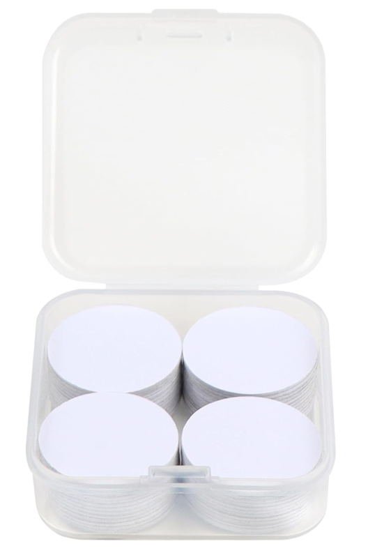

Spesso mi capita di essere prensente a degli eventi o fiere per far conoscere una associazione o un progetto. Ai giorni nostri farsi conoscere sui social e un ottimo strumento per catturare l'attenzione delle persone, per questo agli eventi è molto importante condividere con le persone i siti web e i social del progetto. Uno dei modi sono i famosi QR-CODE ma questa idea non mi convinceva del tutto, quindi ho deciso di realizzarmi un TAG NFC stampato in 3D.

**NFC**

NFC (Near Field Communication) è una tecnologia molto interessante che usiamo tutti i giorni (carte di credito, il pos, il telefono, ecc), permette tramite due antenne (una del dispositivo comunicante e una di quello ricevente), che lavorano all'incirca sulla frequenza 13,50 MHz, di comunicare a brevissima distanza anche con dispositivi non alimentati, questo è il caso dei TAG NFC. Il bello dei TAG NFC è che non hanno necessità di alimentazione quindi possono essere di dimensioni molto ridotte. Sono comoposti da una antenna e un'unità di memoria che contiene il messaggio da trasferire, quando ci avvicianiamo ad un lettore, per esempio quello del telefono, il tag essendo immerso nel campo elettromagnetico generato dal lettore converte il campo in energia elettrica grazie al fenomeno dell'induzione magnetica. Grazie a questa energia il chip del tag si attiva e trasmette al lettore il messaggio.

**IL MIO TAG**

L'idea per realizzare il mio tag era quella di progettare il corpo del tag, metterlo in stampa e quando arriva all'incirca a metà si ferma la stampa e si incolla un circuito adesivo che cotiene il chip e l'antenna che servono per la comunicazione, il circuito si può comprare su amazon per pochi soldi. Di perse il circuito che si compra su amazon funziona come TAG NFC così com'è senza nient'altro ma avere un piccolo corpo dove incollarlo permette di proteggerlo e renderlo anche più bello da vedere. 

Per progettare il corpo del mio tag ho usato Fusion360, da un lato ho inserito la scritta del mio nominativo e dall'altra un motivo di cerchi concetrici, ma si può realizzare come meglio si vuole.

Una volta finita la parte di progettazione ho importato il progetto sul software della mia stampante 3D, dove ho impostato che appena fosse arrivata all'ultimo layer del foro centrale per il tag si fermasse così potevo incollarlo e successivamente finire la stampa. 

Trovate il link del progetto in fondo alla pagina, dove potete scaricare il file per stampare il tag.

